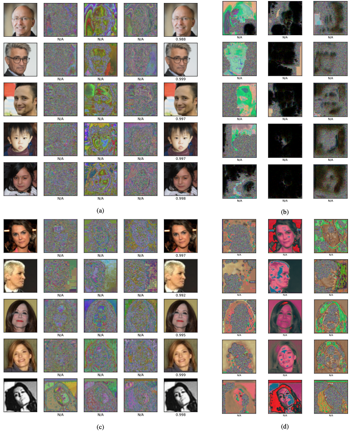
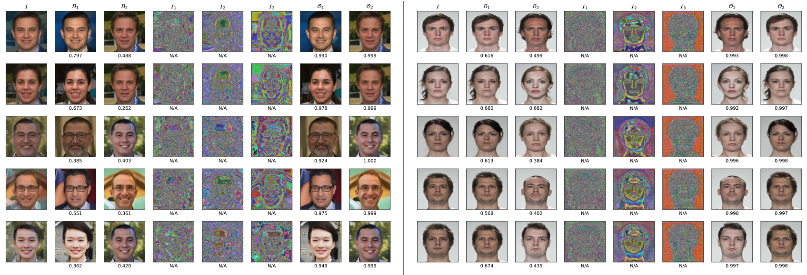

# Facial Demorphing via Identity Preserving Image Decomposition

**Authors:** Nitish Shukla, Arun Ross  
**Venue:**  IEEE International Joint Conference on Biometrics (IJCB,2024)


## Abstract
A face morph is created by combining the face images usually pertaining to two distinct identities. The goal is to generate an image that can be matched with two identities thereby undermining the security of a face recognition system. To deal with this problem, several morph attack detection techniques have been developed. But these methods do not extract any information about the underlying bonafides used to create them. Demorphing addresses this limitation. However, current demorphing techniques are mostly reference-based, i.e, they need an image of one of the identities to recover the other. In this work, we treat demorphing as an ill-posed decomposition problem. We propose a novel method that is reference-free and recovers the bonafides with high accuracy. Our method decomposes the morph into several identity-preserving feature components. A merger network then weighs and combines these components to recover the bonafides. Our method is observed to reconstruct high-quality bonafides in terms of definition and fidelity. Experiments on the CASIA-WebFace, SMDD and AMSL datasets demonstrate the effectiveness of our method. 

## Methodology
<div style="display: flex; gap: 20px;">

<div style="text-align: center;">
  <p> Decomposition Architecture</p>
  
</div>

<div style="text-align: center;">
  <p>Demorphing via Decomposition</p>
  
</div>
</div>

*Figure 1:(Top): Architecture of the decomposition pipeline. A multi-decoder UNet, D, consisting of an encoder and k decoders, decomposes the input, I, into its components. These components are weighed according to w and a multi-encoder UNet, M, consisting of k encoders,  and a decoder, reconstructs the input using the components. (Bottom): Image Decomposition for Demorphing. A decomposer network decomposes the morphed image into its components. The components are then individually picked and weighed by the merger to reconstruct the bonafides*

## Contributions

- **Decomposer-Merger Pipeline:** Introduced a novel deep learning framework where a decomposer network splits a face image into unintelligible components devoid of biometric information, and a merger network reconstructs the original face with high fidelity.  

- **Privacy-Preserving Face Representation:** Ensured that the decomposed components do not contain any identifiable biometric features, enabling secure face processing.  

- **Extension to Demorphing:** Adapted the pipeline to the demorphing problem, where morph faces are decomposed and merged to recover the original constituent face images.  


## Results

The proposed method was evaluated on several benchmark morph datasets, demonstrating superior performance in demorphing accuracy compared to existing techniques. Quantitative results show significant improvements in terms of both visual fidelity and identity preservation.


*Figure 2: Identity decomposition on sample images from the SMDD bonafide and CASIA-WebFace datasets. (a,c) The
first column has the real faces from the datasets, the next three columns are the components extracted by D followed by
the image reconstructed by M. The values under the image denote the similarity score to the original image where ‘N/A’
indicates that a face is not found. (b,d) Attempting to recover identity using only one component. M only recovers the
face iff all the components are present making the individual components obsolete without others.*


*Figure 3: Reference Free Demorphing on SMDD and AMSL datasets. I,B1,B2 are the morph and bonafides,
respectively. I1,I2,I3 are the decomposed components corresponding to I, and O1,O2 denote the outputs produced
by the model. We list the AdaFace similarity score  between the morph and bonafide below B1 and B2. ‘N/A’
represents face-not-found and the scores below O1 and O2 are AdaFace similarity scores between the outputs and their
corresponding bonafides.*


## Usage

To use diffDemorph, follow these steps:

1. **Clone the repository**
```bash
git clone https://github.com/nitishshukla86/diffDemorph.git
cd diffDemorph
```

2. **Download model weights**
```bash
from huggingface_hub import snapshot_download
local_dir = snapshot_download(
    repo_id="nitishshukla/pretrained-weights",
    allow_patterns=["diffDemorph/*"],
    local_dir="./pretrained"
)

```


3. **Demorph**
```bash
python demorph.py --img_path ./assets/morph.png --save_path ./assets/out.png --num_steps 10
```
- `--morph_path`: Path to the morph image.
- `--output_dir`: Directory where demorphed images will be saved.

4. **Training**
```bash
python train_ddpm.py \
    --image_size 256 \
    --latent_size 256 \
    --dataset_csv_path <path to morph csv> \
    --train_batch_size 16 \
    --eval_batch_size 4 \
    --num_epochs 300 \
    --save_image_epochs 10 \
    --save_model_epochs 50 \
    --output_dir "smdd-image-no-condition" \
```
## Citation

```
@INPROCEEDINGS{10744431,
  author={Shukla, Nitish and Ross, Arun},
  booktitle={2024 IEEE International Joint Conference on Biometrics (IJCB)}, 
  title={Facial Demorphing via Identity Preserving Image Decomposition}, 
  year={2024},
  volume={},
  number={},
  pages={1-10},
  keywords={Accuracy;Corporate acquisitions;Face recognition;Image decomposition;Security;Data mining;Image reconstruction},
  doi={10.1109/IJCB62174.2024.10744431}}


```

## License

This work is licensed under a [CC BY 4.0](https://creativecommons.org/licenses/by/4.0/) license.

---

For more details, please refer to the full paper: [arXiv:2507.18566](https://arxiv.org/pdf/2408.10993).
